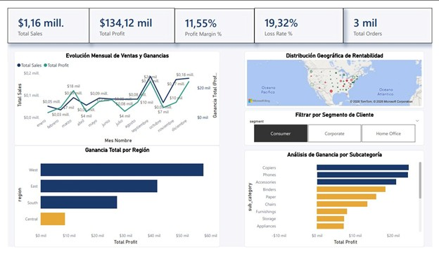

# 📊 Retail Sales Analytics

Pipeline de análisis de datos end-to-end — desde datos crudos hasta dashboard ejecutivo interactivo.



---

## 🎯 Contexto del Proyecto

Análisis de 9,994 transacciones de una empresa retail simulada (GlobalMart) con presencia en 4 regiones de EE.UU. durante el período 2014–2017. El objetivo fue identificar patrones de rentabilidad, detectar subcategorías con pérdidas y construir un dashboard ejecutivo que permita tomar decisiones basadas en datos.

---

## 🔍 Preguntas de Negocio

- ¿Qué regiones y subcategorías generan pérdidas a pesar de su volumen de ventas?
- ¿Cuál es la tendencia de crecimiento real de ventas y margen año sobre año?
- ¿Los descuentos aplicados están erosionando la rentabilidad del negocio?
- ¿Qué segmento de cliente genera mayor valor para la empresa?

---

## 💡 Key Insights

| #   | Hallazgo                                                                               | Impacto  |
| --- | -------------------------------------------------------------------------------------- | -------- |
| 🔴  | **Tables** opera con **-8.56% de margen** — descuentos del 40–50% destruyen valor      | Alto     |
| 🔴  | **Central** tiene **31.9% de órdenes con pérdida** — el mayor riesgo de las 4 regiones | Alto     |
| 🟡  | **18.72% de las órdenes** generan pérdida — 1 de cada 5 transacciones es negativa      | Medio    |
| 🟡  | Descuentos **>20%** correlacionan directamente con profit negativo                     | Medio    |
| 🟢  | Crecimiento YoY **+20.36%** en 2017 — mejor año del período analizado                  | Positivo |

---

## 🔄 Pipeline Técnico

```
superstore.csv  →  Python (pandas)  →  PostgreSQL  →  Power BI
  [Raw Data]         [Limpieza]        [Análisis]     [Dashboard]
```

**Etapa 1 — Limpieza con Python**

- Conversión de fechas, estandarización de columnas a snake_case
- 5 columnas derivadas: `profit_margin`, `order_year`, `order_month`, `shipping_days`, `is_loss`
- Resultado: 0 nulos · 0 duplicados · 0 fechas incoherentes

**Etapa 2 — Análisis SQL en PostgreSQL**

- Q1: Tendencia mensual de ventas por año
- Q2: Rentabilidad por región con ranking (RANK() OVER)
- Q3: Desempeño por categoría y subcategoría
- Q4: Impacto del descuento en la rentabilidad

**Etapa 3 — Dashboard en Power BI**

- Modelo semántico con tabla `Retail Sales` + tabla `Calendario` dedicada
- 9 medidas DAX explícitas en carpeta `_Measures`
- Inteligencia de tiempo: YoY Sales Growth con `SAMEPERIODLASTYEAR`

---

## 📈 KPIs del Dashboard

| Métrica           | Valor      |
| ----------------- | ---------- |
| Total Sales       | $2,297,201 |
| Total Profit      | $286,398   |
| Profit Margin %   | 12.47%     |
| Total Orders      | 5,009      |
| Loss Rate %       | 18.72%     |
| Avg Shipping Days | 4.0 días   |
| YoY Growth 2017   | +20.36%    |

---

## 🤖 Integración IA vía MCP

Este proyecto incorporó **Claude AI + MCP (Model Context Protocol)** para conectarse al modelo semántico de Power BI en tiempo real. Las medidas DAX, la tabla Calendario, las relaciones y la organización del panel de campos fueron creadas y validadas directamente desde el asistente de IA — sin tocar la interfaz de Power BI.

---

## 🛠️ Stack


---

## 📁 Estructura del Repositorio

```
retail-sales-analytics/
├── README.md
├── data/
│   ├── raw/
│   │   └── superstore.csv              # Dataset original (CP1252 encoding)
│   └── processed/
│       └── superstore_clean.csv        # Dataset limpio — 26 columnas
├── notebooks/
│   └── 01_cleaning.ipynb               # Limpieza documentada con pandas
├── sql/
│   ├── 01_create_table.sql             # DDL — CREATE TABLE retail_sales
│   └── 02_analysis_queries.sql         # Q1–Q4 con comentarios
├── powerbi/
│   └── dashboard.pbix                  # Dashboard con modelo DAX
└── docs/
    ├── dashboard_preview.png           # Screenshot del dashboard
    └── project_documentation.docx     # Documentación técnica completa
```

---

## 🚀 Cómo Reproducir

```bash
# 1. Clonar el repositorio
git clone https://github.com/tu-usuario/retail-sales-analytics.git

# 2. Instalar dependencias
pip install pandas numpy jupyter

# 3. Ejecutar la limpieza
jupyter notebook notebooks/01_cleaning.ipynb

# 4. Cargar en PostgreSQL
psql -U postgres -f sql/01_create_table.sql
\copy retail_sales FROM 'data/processed/superstore_clean.csv' CSV HEADER

# 5. Abrir el dashboard
# Abrir powerbi/dashboard.pbix con Power BI Desktop
# Actualizar la conexión a tu instancia de PostgreSQL
```

> **Nota:** El archivo `superstore.csv` original usa encoding **Latin-1 (CP1252)**, no UTF-8. El notebook ya lo maneja con `encoding='latin-1'`.

---

## 📬 Contacto

- **Portfolio:** [Explora mis proyectos en Notion](AQUÍ_PEGAS_EL_LINK)
- **LinkedIn:** linkedin.com/in/tu-perfil: linkedin.com/in/oscareduardofernandez
